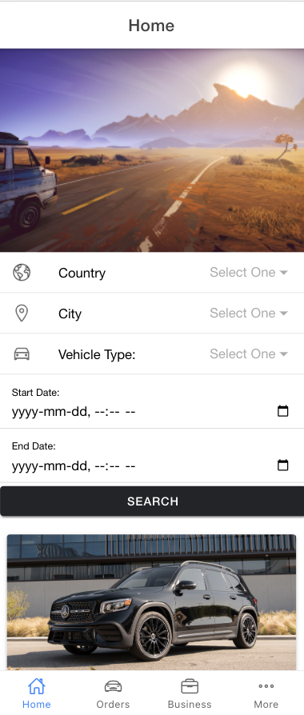
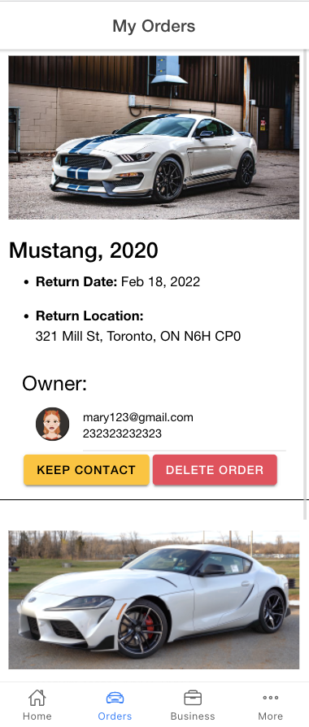
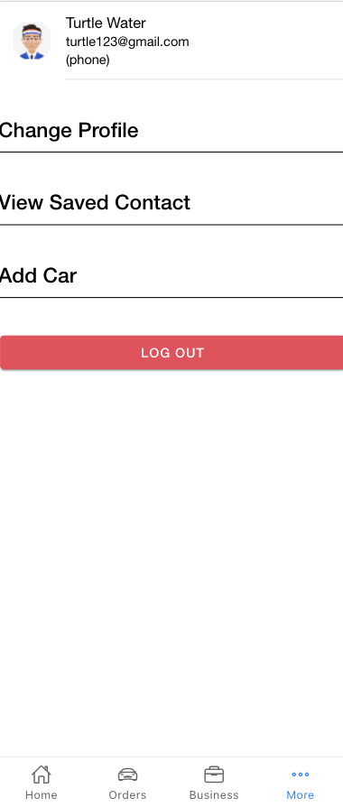

<h1 align="center">
AutoGo - Car Rental Mobile App<br>
 (Ionic Angular)
</h1>

<!-- TABLE OF CONTENTS -->
<details>
  <summary>Table of Contents</summary>
  <ol>
    <li>
      <a href="#about-the-project">About The Project</a>
      <ul>
        <li><a href="#built-with">Built With</a></li>
      </ul>
    </li>
    <li>
      <a href="#getting-started">Getting Started</a>
      <ul>
        <li><a href="#prerequisites">Prerequisites</a></li>
        <li><a href="#installation">Installation</a></li>
      </ul>
    </li>
    <li><a href="#contributing">Contributing</a></li>
    <li><a href="#contact">Contact</a></li>
    <li><a href="#acknowledgments">Acknowledgments</a></li>
  </ol>
</details>


<!-- ABOUT THE PROJECT -->
## About The Project
<h3>AutoGo is a user-freindly automotive rental and leasing mobile app. It's a showcase of Ionic App Platform technologies, including Ionic Framework, Capacitor and miscellaneous plugins.
</h3>
<div float= "left" align="center">



</div>

<p align="right">(<a href="#top">back to top</a>)</p>


### Built With

This section should list any major frameworks/libraries used to bootstrap your project. Leave any add-ons/plugins for the acknowledgements section. Here are a few examples.
* [Ionic](https://ionicframework.com/)
* [Angular](https://angular.io/)
* [Node.js](https://nodejs.org/en/)
* [Bootstrap](https://getbootstrap.com)

<p align="right">(<a href="#top">back to top</a>)</p>


<!-- GETTING STARTED -->
## Getting Started

This is an example of how you may give instructions on setting up your project locally.
To get a local copy up and running follow these simple example steps.

### Prerequisites

This is an example of how to list things you need to use the software and how to install them.
* npm
  ```sh
  npm install npm@latest -g
  ```
  
* Node.js
  ```sh
  https://nodejs.org/en/
  ```

### Installation

_Below is an example of how you can instruct your audience on installing and setting up your app. This template doesn't rely on any external dependencies or services._

1.  Clone the repo
     ```sh
     git clone https://github.com/HenryCZhang/AutoGo-Angular.git
     ```
2. Install NPM packages
   ```sh
   npm install
   ```

3. Connect to the databse

   Navigate to the 'backend' folder inside the 'AutoGo-Angular' folder
   ```sh
   cd backend
   ```
     
   And run
    
   ```sh
   node index.js
   ```
   
4. Serve the frontend

   Open another terminal and navigate to the 'frontend' folder inside the 'AutoGo-Angular' folder
   ```sh
   cd frontend
   ```
        
   And run
    
   ```sh
   ionic serve
   ```

<p align="right">(<a href="#top">back to top</a>)</p>


<!-- CONTRIBUTING -->
## Contributing

Contributions are what make the open source community such an amazing place to learn, inspire, and create. Any contributions you make are **greatly appreciated**.

If you have a suggestion that would make this better, please fork the repo and create a pull request. You can also simply open an issue with the tag "enhancement".
Don't forget to give the project a star! Thanks again!

1. Fork the Project
2. Create your Feature Branch (`git checkout -b feature/AmazingFeature`)
3. Commit your Changes (`git commit -m 'Add some AmazingFeature'`)
4. Push to the Branch (`git push origin feature/AmazingFeature`)
5. Open a Pull Request

<p align="right">(<a href="#top">back to top</a>)</p>


<!-- CONTACT -->
## Contact

Cao Zhang (Henry) - [@LinkedIn](https://www.linkedin.com/in/henry-zhang-uwo/) - henryzhangcao418@gmail.com


<p align="right">(<a href="#top">back to top</a>)</p>


<!-- ACKNOWLEDGMENTS -->
## Acknowledgments

Use this space to list resources you find helpful and would like to give credit to. I've included a few of my favorites to kick things off!

* [Ionic Angular Docs](https://ionicframework.com/docs/angular/your-first-app)
* [Angular](https://angular.io/)
* [Bootstrap](https://getbootstrap.com/)
* [Font Awesome](https://fontawesome.com)
* [Ionic Icons](https://ionic.io/ionicons)

<p align="right">(<a href="#top">back to top</a>)</p>
